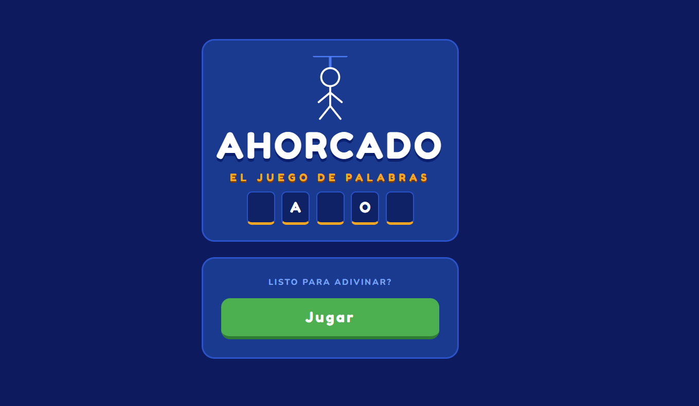
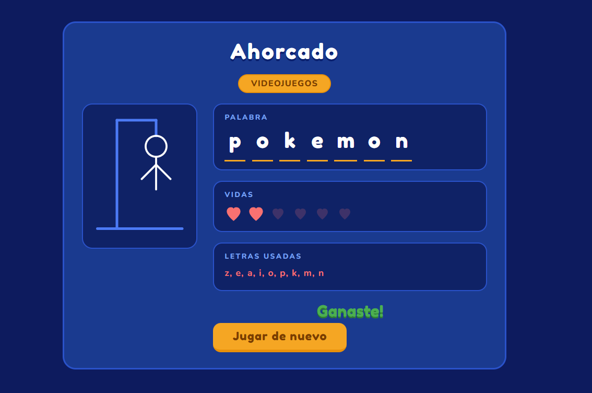

Un juego del ahorcado web hecho con Flask y SQLite. Adivina la palabra antes de quedarte sin vidas.

Cómo jugar?

1. Entra al juego y presiona **Jugar**
2. Se te asignará una palabra de una categoría aleatoria
3. Escribe una letra para adivinar
4. Tienes 6 vidas — cada letra incorrecta pierde una
5. ¡Adivina la palabra completa antes de quedarte sin vidas!

Screenshots

 Categorías

- Cantantes
- Películas
- Animales
- Videojuegos
- Países
- Comida

 Tecnologías

- Python + Flask
- SQLite
- HTML, CSS, JavaScript
- Gunicorn (deploy)

 Características

- Dibujo del ahorcado que se actualiza por partes
- Vidas representadas con corazones
- Letras usadas visibles en pantalla
- Animación de confeti al ganar
- Animación de shake al perder

Desarrollado por: Eduardo Bojórquez — Estudiante de preparatoria.
